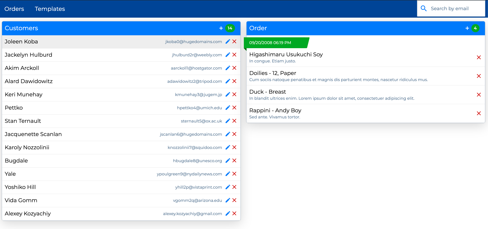

## Installation

To install the API server and its dependencies, run this command:

```npm install```

## Start the Server

To run the server, run this command: 

```npm run start-server```

The output should display the URL of the running server (e.g. http//localhost:3000).

## Start the Client

To run the  client app, run this command: 

```npm run dev```

 Project is running at http://localhost:8080/

## Run test

To run tests, tun the command:

```npm test```

## Packages

| Package                                                | Version                                                                                                                             | Description                                                                        |
| ------------------------------------------------------ | ----------------------------------------------------------------------------------------------------------------------------------- | ---------------------------------------------------------------------------------- |
| [`react`](https://github.com/facebook/react)           | [](https://www.npmjs.com/package/react-router)               | React library                                                                      |
| [`styled-components`](https://www.npmjs.com/package/styled-components)       | [](https://www.npmjs.com/package/styled-components)       | To style react components with minimal CSS                 |
| [`pcln-design-system`](https://www.npmjs.com/package/pcln-design-system) | [](https://www.npmjs.com/package/pcln-design-system) | Design Framework that was initially built by me                 |
| [`redux`](https://www.npmjs.com/package/redux) | [](https://www.npmjs.com/package/redux) | Redux is a predictable state container for JavaScript apps                                       |    
| [`redux-saga`](https://www.npmjs.com/package/redux-saga) | [](https://www.npmjs.com/package/redux-saga) | Saga middleware to handle Side Effects                                       |  